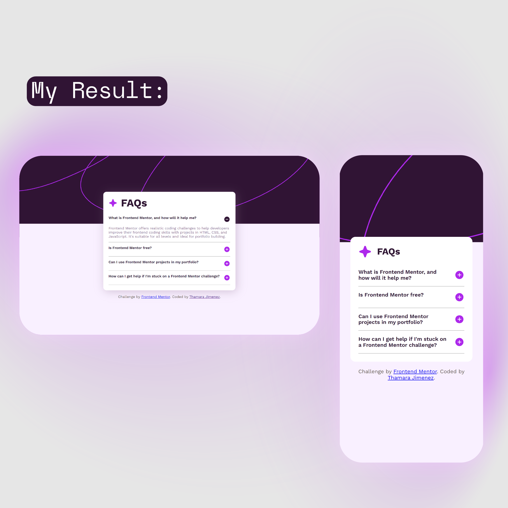

# Frontend Mentor - FAQ accordion solution

This is a solution to the [FAQ accordion challenge on Frontend Mentor](https://www.frontendmentor.io/challenges/faq-accordion-wyfFdeBwBz). Frontend Mentor challenges help you improve your coding skills by building realistic projects. 

## Table of contents

- [Overview](#overview)
  - [The challenge](#the-challenge)
  - [Screenshot](#screenshot)
  - [Links](#links)
- [My process](#my-process)
- [Author](#author)

## Overview

### The challenge

Users should be able to:

- Hide/Show the answer to a question when the question is clicked
- Navigate the questions and hide/show answers using keyboard navigation alone
- View the optimal layout for the interface depending on their device's screen size
- See hover and focus states for all interactive elements on the page

### Screenshot

### Links

- Solution URL: [REPO](https://github.com/ThamaraQueen/FAQ-accordion)
- Live Site URL: [LIVE SITE](https://thamaraqueen.github.io/FAQ-accordion/)

## My process

- __Implement Show/Hide Functionality:__ Use JavaScript to toggle the visibility of the answers and associated elements when a question is clicked.
- __Responsive Layout:__ Use CSS media queries to adjust the layout based on screen size, ensuring the design adapts for different devices.
- __Focus and Hover States:__ Apply focus and hover styles to improve user experience and accessibility for interactive elements.

## Author

- Frontend Mentor - [@ThamaraQueen](https://www.frontendmentor.io/profile/ThamaraQueen)
- LinkedIn - [Thamara Jimenez](https://www.linkedin.com/in/thamara-jimenez-a60ba9244/)

